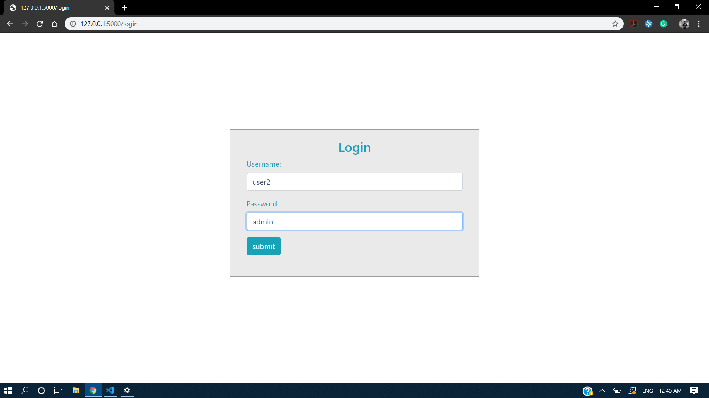
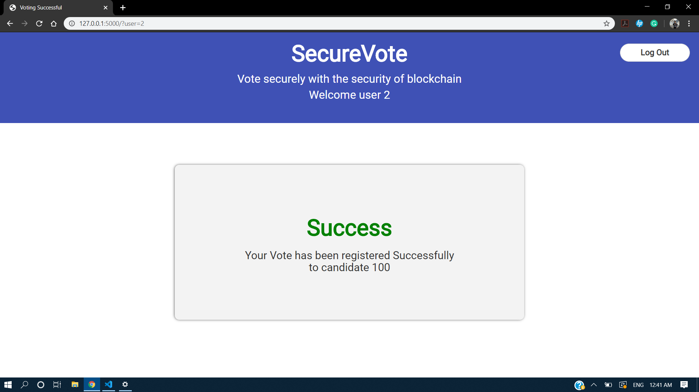
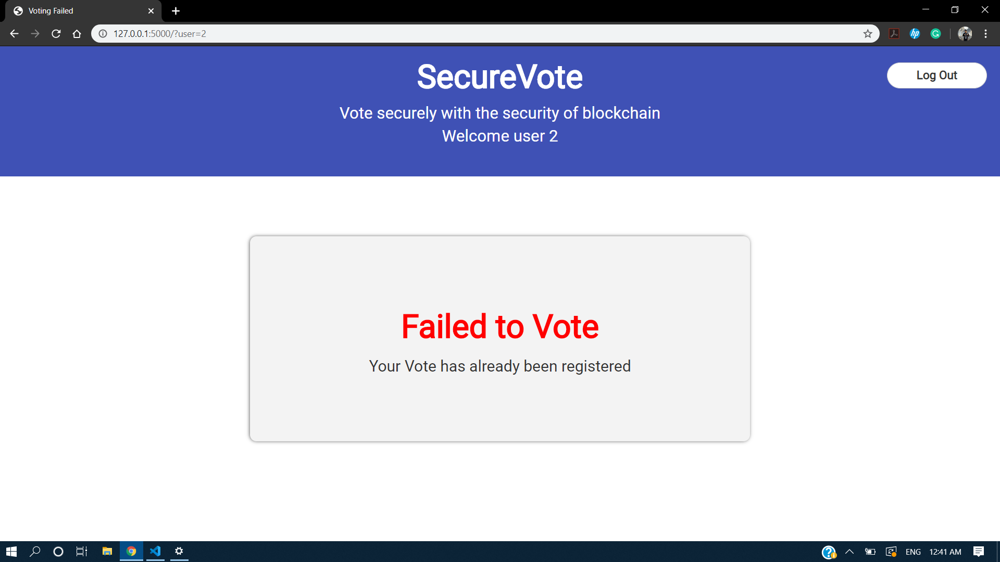

# SecureVote

## POC Implementation of blockchain using cryptography and local storage of nodes. An attempt to such how voting can be done in a secure way using blockchain technology

## Techstack

1. Python
2. Python-Flask
3. Basic HTML/CSS

## Screenshots

